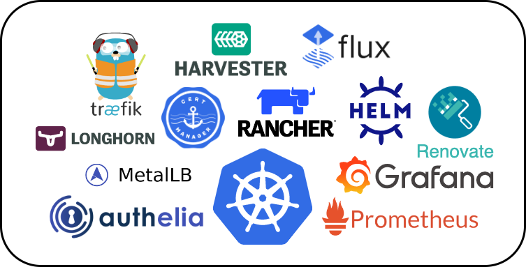

## :book:&nbsp; Overview

This repository is my home Kubernetes cluster in a declarative state.
[Flux](https://github.com/fluxcd/flux2) watches my [cluster](./cluster/) directory and makes the changes to my cluster based on the YAML manifests.

---

## GitOps supercharged Kubernetes cluster
* managed with Flux :robot:

* running on hyper-converged infrastructure

## :computer:&nbsp; Infrastructure

See the [k3s setup](https://github.com/billimek/homelab-infrastructure/tree/master/k3s) in the [homelab-infrastructure repo](https://github.com/billimek/homelab-infrastructure) for more detail about hardware and infrastructure

## :open_file_folder:&nbsp; Repository structure

The Git repository contains the following directories under `cluster` and are ordered below by how Flux will apply them.

- **base** directory is the entrypoint to Flux
- **crds** directory contains custom resource definitions (CRDs) that need to exist globally in your cluster before anything else exists
- **core** directory (depends on **crds**) are important infrastructure applications (grouped by namespace) that should never be pruned by Flux
- **apps** directory (depends on **core**) is where your common applications (grouped by namespace) could be placed, Flux will prune resources here if they are not tracked by Git anymore

## :robot:&nbsp; Automation

* [Renovate](https://github.com/renovatebot/renovate) keeps workloads up-to-date by scanning the repo and opening pull requests when it detects a new container image update or a new helm chart in the upstream repository
* [Container images](https://github.com/Arsenikki/container-images) are automatically built once changes are detected in the upstream container images. Both AMD64 and ARM architectures supported. 

---

## :lock_with_ink_pen:&nbsp; Secret and configmaps management

Secrets are encrypted using [sops](https://github.com/mozilla/sops) before being pushed into this repository.
The encrypted secrets are then decrypted by sops using the private key inside the cluster.
For encryption/decryption, I use [age](https://github.com/FiloSottile/age).
Secrets environment variables for the cluster are in [cluster-secrets.yaml](.cluster/base/cluster-secrets.yaml).
The non-secret variables are in [cluster-settings.yaml](.cluster/base/cluster-settings.yaml).

## :handshake:&nbsp; Community

There is an awesome community out there doing similar stuff at [awesome-home-kubernetes](https://github.com/k8s-at-home/awesome-home-kubernetes)!

There is also an active the [k8s@home Discord](https://discord.gg/7PbmHRK) for this community and great discussion.