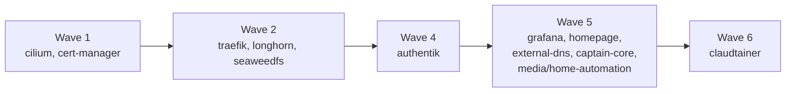

Every workload runs under ArgoCD's app-of-apps: each `Application` object lives in
`cluster/argocd/apps/*.yaml` and points at a Helm chart or a manifest path under
`cluster/apps/<name>/`. Sync order is controlled by `argocd.argoproj.io/sync-wave`
annotations (lower waves first). See [Cluster](/cluster/) and [Networking](/networking/)
for the platform underneath.

All public hostnames sit on the `arsenikki.casa` domain, are served through the
Traefik ingress (`ingressClassName: traefik`), fronted by a wildcard
`*.arsenikki.casa` certificate, and most are gated behind Authentik SSO.

## Platform / infrastructure

These run the cluster itself — CNI, ingress, storage, certs, DNS, identity.

| App | Namespace | What it does | Hostname |
|-----|-----------|--------------|----------|
| cilium | kube-system | eBPF CNI + LoadBalancer (bootstrapped via Helm, then adopted by ArgoCD) | — |
| traefik | traefik | Ingress controller (`ingressClassName: traefik`) | — |
| cert-manager | cert-manager | TLS certificates (Let's Encrypt `letsencrypt-prod` ClusterIssuer) | — |
| longhorn | longhorn-system | Distributed block storage | longhorn.arsenikki.casa |
| external-dns | external-dns | Publishes DNS records to Cloudflare for the `arsenikki.casa` zone | — |
| authentik | authentik | Identity provider / SSO (OIDC + forward-auth outpost) | authentik.arsenikki.casa |
| argocd | argocd | GitOps engine (self-managed) | argocd.arsenikki.casa |
| reloader | kube-system | Restarts pods when their ConfigMap/Secret changes | — |
| seaweedfs | monitoring | In-cluster S3 object store; backs Mimir blocks/ruler/alertmanager + Loki chunks | — |

Companion "resources" Applications (`cilium-resources`, `cert-manager-resources`,
`traefik-resources`, `longhorn-resources`, `authentik-resources`) apply the CRs and
blueprints that configure the above.

### Hardware enablement

| App | Namespace | What it does |
|-----|-----------|--------------|
| intel-device-plugins-operator | (device-plugins) | Manages Intel device plugins |
| intel-gpu-plugin | (device-plugins) | Exposes the Intel iGPU (Plex transcode on worker-01) |
| generic-device-plugin | — | Exposes host devices (e.g. USB) to pods |
| node-feature-discovery | — | Labels nodes by detected hardware features |

## Observability

The monitoring stack lives in the `monitoring` namespace (Grafana LGTM-style:
Loki logs, Mimir metrics, Tempo traces).

| App | Namespace | What it does | Hostname |
|-----|-----------|--------------|----------|
| grafana | monitoring | Dashboards UI; Mimir + Loki datasources, Authentik OIDC SSO | grafana.arsenikki.casa |
| mimir | monitoring | Long-term metrics store (mimir-distributed) | — |
| loki | monitoring | Log aggregation | — |
| tempo | monitoring | Distributed tracing backend | — |
| alertmanager | monitoring | Alert routing / notifications | — |
| k8s-monitoring | monitoring | Grafana Alloy-based cluster telemetry collection | — |
| alloy-jeeves | monitoring | Alloy pipeline scoped to the Jeeves namespaces (+ NetworkPolicy + PrometheusRule) | — |
| pve-exporter | monitoring | Exports Proxmox (PVE) metrics into Prometheus | — |
| prometheus-operator-crds | — | Installs Prometheus-Operator CRDs (ServiceMonitor, PrometheusRule, …) | — |
| monitoring-namespace / monitoring-observability | monitoring | Namespace + shared observability manifests | — |

## Automation

| App | Namespace | What it does |
|-----|-----------|--------------|
| jeeves | jeeves-prod | Autonomous maintenance bot (prod instance) — turns GitHub issues into PRs |
| jeeves-dev | jeeves-dev | Jeeves dev/candidate instance |
| claudtainer | claudtainer | In-cluster AI investigation bot (Telegram + Alertmanager); source in a separate private repo |
| captain-core | captain-core | (See ingress below) |
| renovate-ce | renovate | Mend Renovate CE — opens dependency-update PRs |

`jeeves`/`jeeves-dev` are rendered from the Jeeves repo overlays
(`deploy/overlays/{prod,dev}`); no public ingress is defined for them in this repo.

## User-facing

### Media (`media` namespace)

The \*arr stack plus Plex, all behind Authentik SSO.

| App | Namespace | What it does | Hostname |
|-----|-----------|--------------|----------|
| plex | media | Media server (uses Intel iGPU transcode) | plex.arsenikki.casa |
| overseerr | media | Media request / discovery UI | overseerr.arsenikki.casa |
| sonarr | media | TV series management | sonarr.arsenikki.casa |
| radarr | media | Movie management | radarr.arsenikki.casa |
| lidarr | media | Music management | lidarr.arsenikki.casa |
| readarr | media | Book/audiobook management | readarr.arsenikki.casa |
| bazarr | media | Subtitle management | bazarr.arsenikki.casa |
| prowlarr | media | Indexer manager for the \*arr apps | prowlarr.arsenikki.casa |
| qbittorrent | media | Torrent client | qbittorrent.arsenikki.casa |
| tautulli | media | Plex activity / stats | tautulli.arsenikki.casa |
| cast-sponsor-skip | media | Skips sponsor segments on Chromecast (`ghcr.io/gabe565/castsponsorskip`) | — |
| media-notifier | media | Stdlib-Python relay: Sonarr/Radarr/Overseerr webhooks → Telegram messages | — |

### Home automation (`home-automation` namespace)

| App | Namespace | What it does | Hostname |
|-----|-----------|--------------|----------|
| home-assistant | home-automation | Home Assistant hub (+ code-server sidecar) | homeassistant.arsenikki.casa (code.homeassistant.arsenikki.casa) |
| music-assistant | home-automation | Multi-room music assistant | musicassistant.arsenikki.casa |
| node-red | home-automation | Flow-based automation editor | nodered.arsenikki.casa |
| zigbee2mqtt | home-automation | Zigbee-to-MQTT bridge (pinned to control-plane-01 for the SONOFF USB stick) | zigbee.arsenikki.casa |
| mosquitto | home-automation | MQTT broker | — |
| philips-bridge | home-automation | Philips bridge helper (pinned to control-plane-01) | — |
| k8s-event-exporter | home-automation | Exports Kubernetes events (e.g. to Home Assistant / notifications) | — |

### Other

| App | Namespace | What it does | Hostname |
|-----|-----------|--------------|----------|
| homepage | default | Dashboard / start page | home.arsenikki.casa |
| whoami | authentik | Demo/test app for Authentik forward-auth | whoami.arsenikki.casa |
| captain-core | captain-core | HTTP service on port 8000 (public ingress) | captain-core.arsenikki.casa |

## Sync waves

Waves shown are those annotated on the Applications read for this page; apps without
an explicit `sync-wave` default to wave 0.

