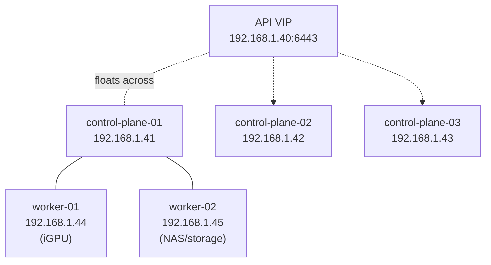

**kuberseni** is a Talos Linux Kubernetes cluster running as VMs on Proxmox. It is
managed by ArgoCD GitOps (repo `Arsenikki/kuberseni-gitops`) and by the [Jeeves](/jeeves/)
autonomous maintenance system. See also [Networking](/networking/) and [Storage](/storage/).

## At a glance

| Property | Value |
| --- | --- |
| Cluster name | `kuberseni` |
| Talos version | v1.13.4 |
| Kubernetes version | v1.35.2 |
| CNI | Cilium 1.19.4 (kube-proxy replacement) |
| Control-plane API endpoint | `https://192.168.1.40:6443` (shared VIP) |
| Config management | talhelper (`infra/talos/talconfig.yaml`) + go-task |
| VM provisioning | OpenTofu (`infra/terraform/`) on Proxmox |

## Nodes

Five nodes: three control-plane and two workers, all on the `192.168.1.0/24` LAN
with static addresses. The `192.168.1.40` VIP floats across the three control-plane
nodes.

| Hostname | IP | Role | Notes |
| --- | --- | --- | --- |
| — (VIP) | 192.168.1.40 | Control-plane API endpoint | Shared VIP; also added to API server cert SANs |
| control-plane-01 | 192.168.1.41 | Control plane | SONOFF Zigbee USB passthrough (udev rule for `ttyACM*`) |
| control-plane-02 | 192.168.1.42 | Control plane | |
| control-plane-03 | 192.168.1.43 | Control plane | |
| worker-01 | 192.168.1.44 | Worker | Intel Iris Xe iGPU passthrough (`i915`); 500GB Longhorn data disk |
| worker-02 | 192.168.1.45 | Worker | NAS machine; 100GB Longhorn data disk; labelled `storage-node=true` |

Node IPs and the VIP are also enumerated as `/32` host routes in the Jeeves Paseo
egress policy (`deploy/base/paseo-lan-egress.yaml`): the Kubernetes API VIP
`192.168.1.40:6443`, and Talos `apid` on `.41`–`.45:50000`.

Control planes do **not** run workloads: `allowSchedulingOnControlPlanes: false`.

## Operating system: Talos Linux

Talos is the immutable, API-driven OS on every node — there is no SSH; nodes are
managed over the Talos `apid` (port `50000`) with `talosctl`.

- **Installer**: bootstrapped from the standard `ghcr.io/siderolabs/installer` ISO for
  a fast first install, then A/B-upgraded to a `factory.talos.dev` schematic that layers
  extensions (`iscsi-tools`, `util-linux-tools`; worker-01 adds `i915` + `intel-ucode`).
- **Time/DNS**: NTP `time.cloudflare.com`; nameservers `1.1.1.1`, `8.8.8.8`.
- **Control-plane specifics**: CNI set to `none` (Cilium installed separately),
  `kube-proxy` disabled (Cilium replaces it), etcd advertised on `192.168.1.0/24` with
  metrics on `:2381`; controller-manager/scheduler metrics rebound to `0.0.0.0`.

## CNI: Cilium

Cilium 1.19.4 is the CNI and **replaces kube-proxy** (`kubeProxyReplacement: true`,
`k8sServiceHost: 192.168.1.40`, `k8sServicePort: 6443`).

Key settings (`cluster/apps/cilium/values.yaml`):

- **IPAM**: `kubernetes` mode.
- **L7 proxy disabled** (`l7Proxy: false`, transparent DNS proxy off) — Talos mounts
  cgroup at root, which breaks host-level socket interception. This is why Jeeves egress
  uses entity-based rules instead of `toFQDNs` (see [Networking](/networking/)).
- **WireGuard** node-to-node encryption enabled.
- **Load balancing**: Maglev algorithm; bandwidth manager on; masquerade via BPF.
- **L2 announcements** enabled for LoadBalancer/external IPs on `ens*` interfaces.
- **Hubble** (relay + UI) enabled.

LoadBalancer IPs come from a `CiliumLoadBalancerIPPool` (`192.168.1.220`–`192.168.1.229`),
announced over L2. Cilium's ArgoCD `Application` was bootstrapped manually via Helm
(`https://helm.cilium.io`) and is now adopted/managed by ArgoCD (sync-wave 1,
`kube-system`).

## Machine-config management

Talos machine config is **not** written by hand per node — it is rendered by
[talhelper](https://github.com/budimanjojo/talhelper) from a single source file and
applied with go-task workflows (`infra/Taskfile.yml`):

1. `infra/talos/talconfig.yaml` — cluster name, versions, endpoint/VIP, and the per-node
   list (hostname, IP, disk, role, network) plus reusable `patches/`.
2. `patches/*.yaml` — layered config (`all.yaml`, `controlplane.yaml`,
   `worker-common.yaml`, plus per-node GPU/storage/Zigbee patches).
3. `talhelper genconfig` renders per-node configs; `talhelper gencommand upgrade`
   produces the correct per-node installer image for Talos upgrades.
4. `talosctl apply-config` / `bootstrap` push config to nodes over `apid`.

The VMs those configs run on are provisioned separately with **OpenTofu** on Proxmox
(`infra/terraform/`, `vms.tf`), with sops-encrypted secrets. Physical hosts: two VMs on
a Minisforum NBP5 (one CP, one iGPU worker), the NAS build (one CP, one worker), and the
Topton router host (one CP).

> ArgoCD self-heals — do not hand-fix drift; commit it. To pause a specific app, set
> `spec.syncPolicy.automated.selfHeal=false` on its `Application`.

