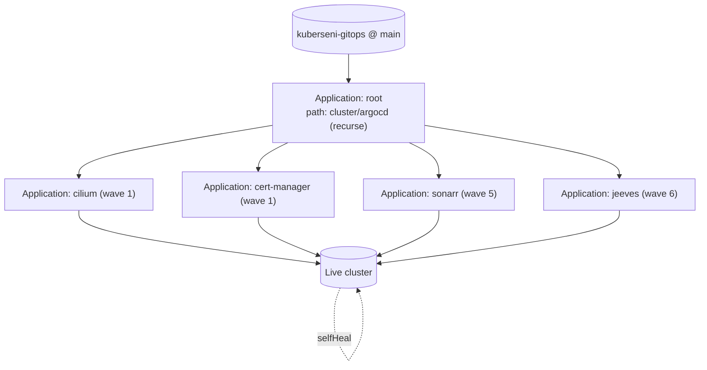

The [cluster](/cluster/) is driven declaratively by **ArgoCD** from
`github.com/Arsenikki/kuberseni-gitops` (`main` branch). ArgoCD continuously
reconciles the live cluster against `cluster/` in Git: it **self-heals** drift,
so the fix for manual drift is to *commit it*, not patch the cluster.

## App-of-apps

A single **root Application** discovers every other Application. It recursively
scans `cluster/argocd/` and applies each `Application` object it finds there.

- Defined in `cluster/argocd/root-app.yaml` (name `root`, namespace `argocd`).
- `spec.source.path: cluster/argocd` with `directory.recurse: true`.
- `syncPolicy.automated`: **`prune: false`**, `selfHeal: true`.
- **Prune is intentionally disabled on the root.** The root manages *Application*
  objects; a source glitch (bad glob, cache miss) with prune on could
  cascade-delete every infra Application, which would then cascade-delete their
  k8s resources via the `resources-finalizer`. To remove an app you delete its
  Application manually: `kubectl delete application <name> -n argocd`.



Both the root and every child Application belong to the **`kuberseni` AppProject**
and carry the `resources-finalizer.argocd.argoproj.io` finalizer.

## The AppProject

`cluster/argocd/projects/kuberseni.yaml` defines the `kuberseni` AppProject —
the trust boundary all Applications run under.

- **`sourceRepos`** — an allow-list of Git/Helm sources. Includes the GitOps repo
  itself, `Arsenikki/claudtainer` and `Arsenikki/jeeves`, plus the upstream Helm
  chart repos (cilium, jetstack/cert-manager, longhorn, traefik, authentik,
  external-secrets, external-dns, prometheus-community, grafana, argo-helm,
  bjw-s-labs, and others). **A chart repo must be listed here before an
  Application may pull from it.**
- **`destinations`** — `https://kubernetes.default.svc` (the in-cluster API),
  namespace `*` (any namespace).
- **`clusterResourceWhitelist`** / **`namespaceResourceWhitelist`** — both `*/*`
  (any group/kind), i.e. this project is unrestricted on resource kinds.

## Sync-waves

Ordering is controlled by the `argocd.argoproj.io/sync-wave` annotation on each
child Application (lower waves sync first). Waves currently in use:

| Wave | Role (examples) |
|------|-----------------|
| 1 | Foundation: `cilium`, `cert-manager`, `longhorn`, `monitoring-namespace` |
| 2 | Depends on wave 1 |
| 3 | — |
| 4 | — |
| 5 | Most user apps (e.g. all `media-*` like `sonarr`) — the bulk |
| 6 | Late apps needing secrets/storage first: `jeeves` (after ESO/1Password + Longhorn) |

`monitoring-namespace` (wave 1) is a dedicated Application that owns the
`monitoring` namespace with privileged PodSecurity labels so it exists before the
storage/CRD apps in that namespace sync.

> Not every Application is annotated — apps without a `sync-wave` fall in the
> default wave (0).

## Directory layout

```
cluster/
├── bootstrap/        # applied by hand once, before ArgoCD self-manages
│   ├── argocd/       # argo-cd Helm values.yaml
│   └── eso/          # external-secrets values + secretstore.yaml (1Password)
├── argocd/
│   ├── root-app.yaml         # the root Application
│   ├── projects/             # AppProject(s): kuberseni.yaml
│   └── apps/                 # one Application manifest per app (recursed by root)
└── apps/             # the actual app manifests / Helm values, grouped by namespace
    ├── cilium/ cert-manager/ longhorn/ traefik/ authentik/ external-dns/ …
    ├── media/        # bazarr lidarr plex prowlarr radarr readarr sonarr … (ns: media)
    ├── home-automation/  # home-assistant mosquitto node-red zigbee2mqtt …
    ├── monitoring/   # grafana loki mimir tempo prometheus-operator-crds seaweedfs …
    └── default/      # homepage, …
```

Key split: **`cluster/argocd/apps/<app>.yaml`** is the ArgoCD `Application`
(the *pointer*); **`cluster/apps/<ns>/<app>/`** holds the *content* it points at
(Helm `values.yaml`, extra manifests like `pvc.yaml`).

### Application shapes

Child Applications come in two common shapes:

- **Helm + values** (multi-source): a `chart` source pins `targetRevision`, and a
  second source `ref: values` from the GitOps repo supplies
  `$values/cluster/apps/<ns>/<app>/values.yaml`. `sonarr` adds a *third* source —
  a plain-manifest `path` (with `directory.exclude: "values.yaml"`) for extra
  objects like its PVC. See `cluster/argocd/apps/cilium.yaml`,
  `cert-manager.yaml`, `media-sonarr.yaml`.
- **Plain directory** (no Helm chart): a single `source.path` pointing at raw
  manifests, e.g. `monitoring-namespace.yaml`, `jeeves.yaml` (which renders
  `deploy/overlays/prod` from the private `Arsenikki/jeeves` repo).

ArgoCD itself is managed **by** ArgoCD (`cluster/argocd/apps/argocd.yaml`, the
argo-cd Helm chart) after the initial bootstrap.

## Adding a new app

1. **Content** — create `cluster/apps/<ns>/<app>/` with your `values.yaml`
   (for a Helm app) and/or plain manifests. Group it under the target namespace
   directory.
2. **Application** — add `cluster/argocd/apps/<app>.yaml` (kind `Application`,
   namespace `argocd`, `project: kuberseni`):
   - point its Helm source at an allowed chart (add the chart repo to the
     AppProject `sourceRepos` if it's new), with the values source referencing
     `$values/cluster/apps/<ns>/<app>/values.yaml`; **or** a plain `source.path`;
   - set `destination.namespace: <ns>` and, unless the namespace is pre-created,
     `syncOptions: [CreateNamespace=true]`;
   - annotate `argocd.argoproj.io/sync-wave` if it has ordering deps (else it
     defaults to wave 0 — put most user apps at `5`);
   - add the `resources-finalizer.argocd.argoproj.io` finalizer.
3. **PR it.** The root Application recurses `cluster/argocd/` and picks up the new
   Application automatically once merged — no root edit needed.

Pin versions (never `latest`), and store secrets via ESO / 1Password, never in Git.

## CI quality gates

Every PR to `main` (see repo [CLAUDE.md](/) rules — never push to `main`
directly) runs these checks:

| Check | Workflow | What it does |
|-------|----------|--------------|
| **`yaml`** | `.github/workflows/lint.yaml` | `yamllint -c .github/yamllint.config.yaml ./cluster/` via reviewdog, reported as PR review comments |
| **Render ArgoCD diff** | `.github/workflows/argocd-diff.yaml` | Renders every Application from base + PR branch in an **ephemeral in-CI ArgoCD** (no live-cluster access, no repo creds) and posts the resulting diff as a PR comment |

- **yamllint config** (`.github/yamllint.config.yaml`): extends `default`;
  ignores `.github/` and `crds.yaml`; `line-length` disabled; `indentation`
  2 spaces with consistent sequence indent; `truthy` limited to
  `true/false/on/yes`.
- **ArgoCD diff preview** runs the `dagandersen/argocd-diff-preview` container.
  Because it has no repo credentials, Applications sourced from **private** repos
  (e.g. `jeeves`) set `argocd-diff-preview/ignore: "true"` so the preview skips
  them; the live cluster renders them normally using its `jeeves-repo`
  ExternalSecret credential.
- **prek / pre-commit** (`.pre-commit-config.yaml`): the `yamllint` hook
  (`adrienverge/yamllint` v1.37.1) with the same
  `-c .github/yamllint.config.yaml`, run locally / by Jeeves before commit.

### cluster/** human-review rule

[Jeeves](/jeeves/) autonomous merges are gated by path:

- Changes **outside `cluster/**`** may auto-merge once the gate is green (prek
  hooks + required checks `yaml` and `Render ArgoCD diff` + `yamllint ./cluster/`)
  — but only when low-risk and non-behavioral.
- Anything **touching `cluster/**`** (ArgoCD self-heals it onto the cluster on
  merge), or any higher-risk / behavioral change, is left for a **human to review
  and merge on GitHub**. Adding `human/hold` to the issue freezes auto-merge.

