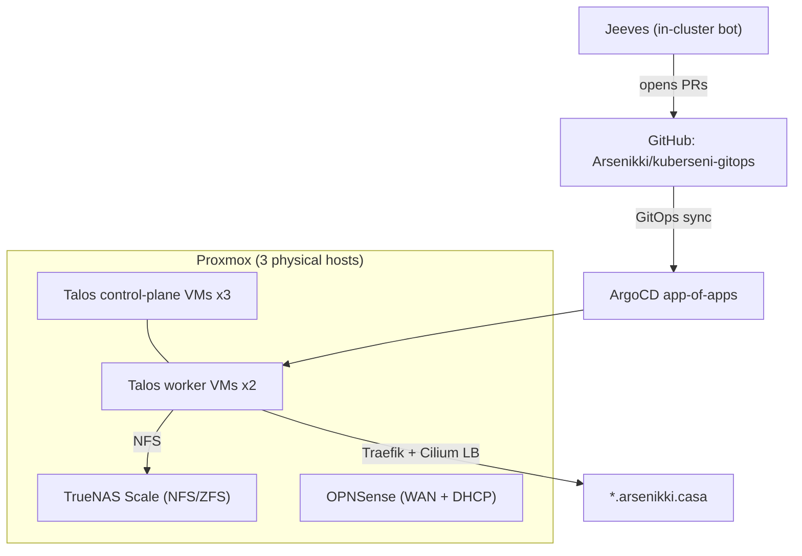

This is the single source of truth for **kuberseni** — a self-hosted Kubernetes homelab. It is written both for humans and for the autonomous agents (Jeeves) that maintain it.

## What this is

- **Kubernetes** cluster named `kuberseni`, running **Talos Linux** (immutable, API-managed OS) on VMs.
- Virtualized on **Proxmox** across three physical machines; VMs and the OPNSense/TrueNAS config are provisioned with **OpenTofu** (`infra/terraform/`), Talos machine config rendered by **Talhelper** (`infra/talos/talconfig.yaml`).
- Everything in-cluster is **GitOps** — **ArgoCD** app-of-apps continuously syncs the `cluster/` tree from `Arsenikki/kuberseni-gitops`. Don't hand-fix drift; commit it (ArgoCD self-heals).
- Maintenance is (partly) autonomous: **[Jeeves](/jeeves/)** turns a GitHub issue labelled `jeeves` into a reviewed PR. This repo is registered and eligible.

## At a glance

| Aspect | Value |
|---|---|
| Cluster name | `kuberseni` |
| OS | Talos Linux (VMs on Proxmox) |
| Nodes | 3 control-plane + 2 workers (`control-plane-01..03`, `worker-01..02`) |
| Kubernetes API | `https://192.168.1.40:6443` |
| Ingress / apps domain | `*.arsenikki.casa` |
| Ingress | Traefik behind a Cilium LoadBalancer (L2 announcements) |
| DNS | Cloudflare via external-dns (zone `arsenikki.casa`) |
| CNI | Cilium |
| Storage | Longhorn (in-cluster, default 2 replicas) + TrueNAS Scale over NFS (ZFS mirror) |
| GitOps | ArgoCD app-of-apps (`cluster/argocd/root-app.yaml`), repo `Arsenikki/kuberseni-gitops` |
| IaC | OpenTofu (`tofu`) + Talhelper; secrets sops-encrypted |
| Secrets | External Secrets Operator + 1Password Connect |
| Automation | Jeeves (issue → PR), Renovate (dependency PRs) |

## Topology

## Navigate

- **[Cluster](/cluster/)** — nodes, Talos config, control plane, workloads by namespace.
- **[Networking](/networking/)** — Cilium CNI, LoadBalancer/L2, Traefik ingress, external-dns, OPNSense.
- **[Storage](/storage/)** — Longhorn and TrueNAS/NFS.
- **[GitOps](/gitops/)** — ArgoCD app-of-apps, sync/self-heal, OpenTofu + Talhelper.
- **[Applications](/applications/)** — the apps under `cluster/apps/` (media, home-automation, monitoring, authentik, captain-core, …).
- **[Secrets](/secrets/)** — External Secrets Operator, 1Password Connect, sops.
- **[Jeeves](/jeeves/)** — the autonomous maintenance system: how to file tickets, the lifecycle, and the merge gate.
- **[Runbooks](/runbooks/)** — operational procedures (bootstrap, tofu apply, ArgoCD, common gotchas).

## Handing work to Jeeves

File **one GitHub issue per deliverable, labelled `jeeves`**, in `Arsenikki/kuberseni-gitops`. That label is the only trigger; the prod instance claims it within ~5 min. Write the body for an agent — desired end state, acceptance criteria, files/paths to touch, and repo rules (sops-encrypted secrets, pin versions never `latest`, commit ArgoCD drift rather than hand-fixing it). Changes touching `cluster/**` are always left for human review; low-risk, non-behavioral changes elsewhere can auto-merge once the gate is green. See **[Jeeves](/jeeves/)** for details.

