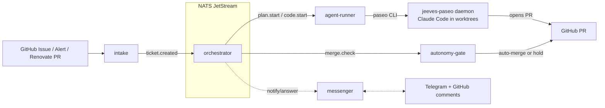

**Jeeves** is a ticket-driven autonomous software-maintenance system. A GitHub
Issue goes in; an isolated coding agent plans it, writes the code in its own git
worktree, runs the repo's quality gate, and opens a PR — steered entirely from
**GitHub labels + Telegram**. It manages the [kuberseni-gitops](/cluster/) repo
(and others), running in the same Talos cluster it maintains.

Repo: [`Arsenikki/jeeves`](https://github.com/Arsenikki/jeeves). It is
general-purpose (web apps, IaC, anything), not tied to one project.

## Design principle: deterministic glue, AI only in Paseo

Jeeves is **Go microservices on Kubernetes, coordinated over NATS JetStream**.
One binary (`jeeves <service>`) → one image → N Deployments.

The control plane is **deterministic glue — no AI runs in these services.** All
model work happens inside an **in-cluster Paseo daemon** (`jeeves-paseo`) that the
`agent-runner` drives via the `paseo` CLI. Paseo runs **Claude Code** agents, each
in its own git worktree on the daemon's PVC.



## Services

All services run the same image with a different subcommand. Singletons
(`orchestrator`, `messenger`) stay at one replica; only `agent-runner` scales
(bounded by per-phase concurrency caps).

| Service | Subcommand | Kind | Responsibility |
|---|---|---|---|
| `intake` | `jeeves intake` | Deployment (1) | All ticket sources in one pod → `ticket.created`: GitHub issues (webhook on :8080 + poll), Alertmanager (webhook), Renovate PR triage, GitHub Projects board poll. Also runs the decision-answer and PR-revision polls. |
| `orchestrator` | `jeeves orchestrator` | Deployment (1, `Recreate`) | **Single-leader** label state machine; the sole writer of ticket state. Drives all transitions and fans out PR-review advisors. |
| `agent-runner` | `jeeves agent-runner` | Deployment (scalable) | The **only** service that shells `paseo` (plan / code / send / review / verify). Concurrency-capped per phase. |
| `messenger` | `jeeves messenger` | Deployment (1, `Recreate`) | Two-way **Telegram** long-poller + GitHub issue comments — notifies *and* collects answers. One poller per instance (own bot token). |
| `autonomy-gate` | `jeeves autonomy-gate` | Deployment (1) | The autonomy ceiling: risk + quality gate → **auto-merge or stop**. Only this service merges. |
| `token-broker` | `jeeves token-broker` | Sidecar in `jeeves-paseo` | Holds the GitHub App private key and mints short-lived installation tokens over a **unix socket** — so the durable key lives only here, never in the agent container. |
| `repo-sync` | `jeeves repo-sync` | Sidecar in `jeeves-paseo` | Clones/fetches the managed repos onto the daemon PVC for worktrees; hot-reloads the registry each cycle (no daemon roll). |
| `digest` | `jeeves digest` | CronJob (06:00 UTC daily) | One-shot Telegram morning summary of *this instance's* overnight ticket activity. NATS-independent (reads GitHub only), so it reports even when the pipeline is degraded. |

> A `dashboard` service (live telemetry graph) is designed but **not built** (a
> stub). It's a P3 backlog item.

### NATS JetStream contract

Stream `JEEVES` over subject space `jeeves.>`, with a 2-minute dedup window and
durable consumers (replicas share a durable for load-balancing). Key subjects:
`ticket.created|updated`, `plan.start|ready`, `decision.needed|answered`,
`code.start`, `code.pr_opened`, `advisor.start|done`, `merge.check`,
`gate.passed`, `merge.done`, `verify.start|done`, `escalation`. Every payload
carries `{schema_version, ts, repo, issue, dedup}`. NATS uses **token auth** — the
Go services hold `$NATS_TOKEN`; the Paseo pod does **not**, so an injected agent
can't publish forged lifecycle events even though it can reach NATS at the network
layer.

## Ticket lifecycle

`Inbox → Triage/Planning → (Needs-Decision ⇄) → In-Progress → In-Review → Done`,
tracked as GitHub labels (the orchestrator is the sole writer of `agent/*`):

`agent/{planning,needs-decision,in-progress,pr-open,done,failed}` ·
`human/{approved-plan,approved-merge,hold,takeover}`.

- **Front-loaded planning.** The plan agent batches **all** its questions up
  front. If it has questions → `agent/needs-decision` + a Telegram ping; otherwise
  it proceeds straight to coding. A vague ticket stalls, so write the body for an
  agent (desired end state, acceptance criteria, paths to touch, constraints).
- **Coding.** The agent codes in an isolated `paseo worktree` under
  `--mode bypassPermissions` and opens a PR (`Closes #<issue>`).
- **PR-review advisors** (`internal/advisor` + `advisors.yaml`). On `code.pr_opened`
  the orchestrator fans out read-only reviewer agents that emit
  `approve | request-changes | needs-human` + an `extra_risky` flag. Advisors are
  always enabled; the `review` advisor is `blocking: true`. A `request-changes`
  verdict re-enters coding (the revision loop, bounded by `JEEVES_ADVISOR_ROUND_CAP`).
- **Revision loop.** While a ticket is `agent/pr-open`, an intake poll turns each new
  human "Request changes" review into another coding round; the agent pushes to the
  same PR. The same poll detects a human merge → `agent/done`.
- **Post-merge verify** (opt-in per repo). After a merge, a `verify` agent confirms
  the deploy before the ticket closes; a failure files a linked follow-up bug and
  escalates.

## Autonomy & the merge gate

The agent can at most **open a PR** — only `autonomy-gate` merges. Auto-merge
requires all of:

- the repo is `eligible: true` in the [registry](#managed-repo-registry) (it
  declares a real quality gate);
- the PR is mergeable, every declared required check is green, no path in
  `no_automerge_paths`, and no `human/hold`;
- the trust signal passes: with a blocking advisor, a clean **advisor approval**
  (not `extra_risky`); otherwise the legacy `risk/low` + non-behavioral ceiling;
- the instance runs `JEEVES_AUTONOMY=auto`.

A human GitHub approval (`human/approved-merge`) overrides the trust signal but
never the hard guards. Anything the advisor flags `extra_risky`
(deploy-on-merge / infra, e.g. `cluster/**`) is held for a human.

## Dev vs prod instances

Two **co-located, fully-isolated** instances run in the homelab Talos cluster —
each with its **own** namespace, NATS, Paseo daemon, and PVCs. They watch the same
repos but stay disjoint via a distinct trigger label.

| | **prod** | **dev** |
|---|---|---|
| Namespace | `jeeves-prod` | `jeeves-dev` |
| Channel / image tag | promoted (stable) | edge (every release) |
| Trigger label | `jeeves` | `jeeves-dev` |
| Autonomy | `auto` (may auto-merge) | `propose` (never merges) |
| Claims | unlabeled + `jeeves` tickets | only its `jeeves-dev`-labelled tickets |
| Telegram bot | own token (General topic) | `AgenticJeevesDevBot` (topic id 471) |
| Per-phase agent cap | 2 | 1 |
| Renovate intake | on | off (`RENOVATE_INTERVAL=0`) |

- **Promotion:** dev runs every release (edge, `<semver>-<branch>-<shortsha>`);
  only a version proven on dev is promoted to prod via
  `.github/workflows/promote.yml`. ArgoCD watches the prod overlay on `main`, so a
  promotion rolls prod; a release does not.
- Each Paseo StatefulSet is renamed per overlay so the daemons advertise distinct
  identities (`jeeves-prod-0` / `jeeves-dev-0`); the Service stays `jeeves-paseo`.
- The `jeeves-paseo` **daemon image is pinned separately** and left untouched by a
  promotion — rolling it would kill in-flight coding agents.

> **Deploy model.** Prod is deployed via [kuberseni-gitops](/cluster/) (ArgoCD)
> from `deploy/overlays/{prod,dev}`; ghcr images, ExternalSecrets (1Password),
> Longhorn storage. Merge to `main` → CI pushes images → ArgoCD syncs.

## Managed-repo registry

`deploy/base/files/repos.yaml` is the **only** place repo-specific data lives. A
repo is `eligible` for autonomous merge only if it declares a real quality gate;
otherwise Jeeves still opens PRs but every merge is human-reviewed.

| Repo | `eligible` | Gate / notes |
|---|---|---|
| `Arsenikki/kuberseni-gitops` | **true** | `prek` + required checks `yaml`, `Render ArgoCD diff`; `yamllint ./cluster/`. `no_automerge_paths: ["cluster/**"]` — ArgoCD self-heals on merge, so infra is human-reviewed. |
| `Arsenikki/jeeves` | **false** | Self-development, always human-reviewed. Only the **prod** instance builds Jeeves (dev must not build itself); `eligible: false` is the safety net. Runs `prek` as its own gate. |
| `Arsenikki/captain-core` | **false** | Not eligible until it declares a real test/lint gate. Its unofficial upstream API must never be hit by agents. |
| `Arsenikki/bazzite-chromebook-cx3402cva` | **false** | No CI/tests/pre-commit; `risk_ceiling: low` (restrictive) fits a brick-the-boot repo. |

## GitHub auth (no long-lived tokens)

A **GitHub App** ("paseo-homelab") is the identity. `internal/ghapp` mints
short-lived installation tokens from the App private key (RS256 JWT, cached). Go
services inject a fresh token per `gh` call; the daemon uses a
`jeeves git-credential` helper that fetches tokens from the `token-broker` over a
unix socket — so `git` clone/push always get a valid token and the durable
private key never sits in the agent container.

## Agent containment (defense-in-depth)

Agents run untrusted GitHub-issue / alert content, so the `jeeves-paseo` daemon is
hardened beyond the autonomy ceiling:

- **Runs non-root** (uid 1000); Claude Code refuses `bypassPermissions` as root.
- **Read-only cluster identity** — a dedicated `jeeves-cluster-reader` ClusterRole
  (no secrets, configmaps, serviceaccounts, `pods/exec`, or write verbs), reached
  only via a mounted kubeconfig; the SA token is not auto-mounted.
- **Egress containment** — a `NetworkPolicy` + `CiliumNetworkPolicy` allow only
  DNS, same-namespace pods, three read-only infra `/32`s (K8s API, Talos apid,
  OPNsense), and public `443/80`. See [Networking](/networking/) and
  [Security](/security/) for detail.
- **Read-only infra creds** (kubeconfig / talosconfig / OPNsense) are mounted into
  the paseo container only — read-only-ness is enforced by the *credential*, not
  by agent mode.

## How Jeeves reads this knowledge base

Every agent run is seeded with a persona prompt (`deploy/base/files/warmup.md`)
that points it here:

> For homelab/infrastructure context, consult the knowledge base at
> `/data/paseo/repos/kuberseni-gitops/docs/homelab/` (if present) — read only the
> pages relevant to your task.

`repo-sync` mirrors `kuberseni-gitops` onto the daemon PVC at
`/data/paseo/repos/kuberseni-gitops`, so this KB (`docs/homelab/`) is on disk
inside every worktree. **This is the single source of truth these docs describe —
keep it accurate, because the agents maintaining the homelab read it directly.**

## Handing work to Jeeves

File **one issue per deliverable, labelled `jeeves`** (the only trigger). The prod
instance claims it within ~5 min (issue poll), or seconds via webhook.

```bash
gh issue create -R Arsenikki/kuberseni-gitops --label jeeves \
  --title '<imperative, single-PR-sized summary>' \
  --body  '<desired end state + acceptance criteria + paths to touch + constraints>'
```

- **Write for an agent**, not a human: acceptance criteria, files/paths, repo rules.
- **Route to dev:** add `jeeves-instance/dev` (a bare `jeeves` goes to prod).
- **Track it** via the `agent/*` labels Jeeves stamps; don't set them yourself.
- **Answer a `needs-decision`** by replying to the bot's Telegram message, or by
  posting a GitHub issue comment (the decision poll / `issue_comment` webhook picks
  it up).

See [`Arsenikki/kuberseni-gitops` `CLAUDE.md`](/cluster/) → "Handing work to
Jeeves" for the full contract.

