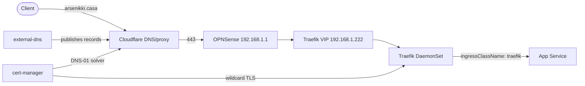

Ingress into the **kuberseni** cluster is served by **Traefik**, exposed on a LAN VIP via
Cilium L2 announcements. TLS is a single wildcard cert for `arsenikki.casa` issued by
cert-manager (Let's Encrypt, Cloudflare DNS-01). DNS records are published to Cloudflare
by external-dns. The LAN edge is an **OPNSense** router/firewall at `192.168.1.1`.

See also [Cluster](/cluster/) and [Storage](/storage/).

## Traffic flow



## Traefik ingress

Source: `cluster/apps/traefik/values.yaml`

| Setting | Value |
|---|---|
| Deployment kind | `DaemonSet` |
| Service type | `LoadBalancer` |
| LB VIP | `192.168.1.222` (annotation `io.cilium/lb-ipam-ips`) |
| externalTrafficPolicy | `Cluster` |
| Ingress class | `traefik` (`kubernetesIngress` + `kubernetesCRD` providers enabled) |
| Cross-namespace refs | `allowCrossNamespace: true` |
| Metrics | Prometheus on entrypoint `metrics` (`:9100`) |
| Placement | control-plane nodes only (`nodeSelector` + tolerations) |

- Traefik pods run with `readOnlyRootFilesystem`, all capabilities dropped except
  `NET_BIND_SERVICE`, and `allowPrivilegeEscalation: false`.
- The `websecure` entrypoint sets `forwardedHeaders.trustedIPs` to the LAN ranges
  (`10.0.0.0/8`, `192.168.0.0/16`) plus Cloudflare's published IP ranges, so the real
  client IP survives the Cloudflare proxy.

### VIP advertisement (Cilium)

The `LoadBalancer` VIP is allocated and announced by Cilium — there is no MetalLB.

- **IP pool** (`cluster/apps/cilium/resources/load-balancer-ip-pool.yaml`):
  `CiliumLoadBalancerIPPool` block `192.168.1.220`–`192.168.1.229` (a transition range
  that avoids the old cluster's `.200`; slated to expand to `192.168.1.200/29` at cutover).
- **L2 announcement** (`cluster/apps/cilium/resources/l2-announcement-policy.yaml`):
  `CiliumL2AnnouncementPolicy` announces `loadBalancerIPs` and `externalIPs` on
  interfaces matching `^ens[0-9]+`.

## DNS — external-dns → Cloudflare

Source: `cluster/apps/external-dns/values.yaml`

| Setting | Value |
|---|---|
| Provider | `cloudflare` |
| Zone / domain filter | `arsenikki.casa` (zone id `7df358b698302620e051a2aa2c9724cb`) |
| Sources | `crd`, `ingress` |
| Policy | `sync` |
| Registry ownership | TXT records, `txtOwnerId: main`, `txtPrefix: k8s.` |

- The Cloudflare API token comes from 1Password via ESO (`ExternalSecret`
  `cloudflare-api-token`, item `cloudflare`, property `api_token` — see
  `cluster/apps/external-dns/externalsecrets.yaml`).
- **Ingress records** are derived from `Ingress` hosts.
- **Static infra records** (bare-metal hosts with no K8s Ingress) are published from a
  `DNSEndpoint` CRD (`cluster/apps/external-dns/infra-hosts.yaml`), e.g.:

| Hostname | Target |
|---|---|
| `opnsense.arsenikki.casa` | `192.168.1.1` |
| `truenas.arsenikki.casa` | `192.168.1.2` |
| `router.proxmox.arsenikki.casa` | `192.168.1.10` |
| `minipc.proxmox.arsenikki.casa` | `192.168.1.11` |
| `nas.proxmox.arsenikki.casa` | `192.168.1.12` |

These are LAN-only addresses that serve their own TLS certs.

## TLS — cert-manager (wildcard)

Source: `cluster/apps/cert-manager/resources/letsencrypt-prod.yaml`,
`cluster/apps/traefik/resources/`

- **ClusterIssuer** `letsencrypt-prod` — ACME against
  `https://acme-v02.api.letsencrypt.org/directory`, solved via **Cloudflare DNS-01**
  (token from ESO secret `cloudflare-token-secret`). A staging issuer
  `letsencrypt-stag` also exists.
- **Wildcard certificate** `arsenikki-casa` in the `traefik` namespace covers
  `arsenikki.casa` and `*.arsenikki.casa`, stored in secret `arsenikki-casa-tls`
  (`privateKey.rotationPolicy: Always`).
- Traefik uses that secret as its **default certificate** via a `TLSStore`
  (`default-tls-store.yaml` → `defaultCertificate.secretName: arsenikki-casa-tls`), so
  every host terminates on the wildcard even without a per-app cert.
- The default `TLSOption` enforces `minVersion: VersionTLS12`
  (`default-tls-options.yaml`).

## Standard ingress annotations

Apps that expose an HTTP UI attach the same annotation set. Canonical example
(from `cluster/apps/captain-core/ingress-app.yaml`):

```yaml
apiVersion: networking.k8s.io/v1
kind: Ingress
metadata:
  name: captain-core-app
  namespace: captain-core
  annotations:
    kubernetes.io/tls-acme: "true"
    cert-manager.io/cluster-issuer: letsencrypt-prod
    external-dns/is-public: "true"
spec:
  ingressClassName: traefik
  rules:
    - host: captain-core.arsenikki.casa
      http:
        paths:
          - path: /
            pathType: Prefix
            backend:
              service:
                name: captain-core-app
                port:
                  number: 8000
  tls:
    - hosts:
        - captain-core.arsenikki.casa
      secretName: captain-core-app-tls
```

Annotation meanings:

| Annotation | Purpose |
|---|---|
| `cert-manager.io/cluster-issuer: letsencrypt-prod` | Issue a per-host cert from the prod ClusterIssuer |
| `kubernetes.io/tls-acme: "true"` | Legacy ACME opt-in flag |
| `external-dns/is-public: "true"` | Convention marker that the host is intentionally published to Cloudflare |
| `ingressClassName: traefik` | Route through the Traefik ingress controller |

The same set is used by Grafana, ArgoCD, and other Helm-based apps (via their chart's
`ingress.annotations`). Apps that sit behind SSO additionally add the Traefik middleware
annotation `traefik.ingress.kubernetes.io/router.middlewares:
"authentik-forward-auth@kubernetescrd"` — see [Authentication](/auth/).

## OPNSense router / firewall

- OPNSense is the LAN gateway/firewall at **`192.168.1.1`** (published as
  `opnsense.arsenikki.casa`).
- Jeeves agents may reach the OPNSense API on `443` (a scoped read user) — this is one of
  the few LAN `/32` host routes the agent egress policy allows
  (`deploy/base/paseo-lan-egress.yaml`).

