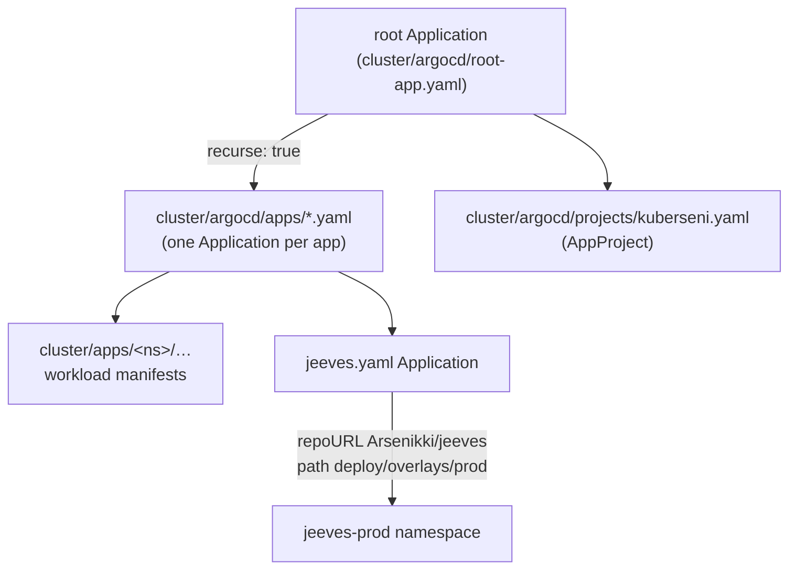

Action-oriented runbooks for operating the **kuberseni** Talos/Proxmox cluster
and the **Jeeves** autonomous maintenance system. Each is short and grounded in a
real config or incident. See also [Cluster](/cluster/), [Networking](/networking/),
and [Jeeves](/jeeves/) for background.

> Ground rules that shape every runbook here:
> - **Never fix ArgoCD drift by hand — commit it.** ArgoCD `selfHeal` reverts
>   manual changes. To pause self-heal, set `spec.syncPolicy.automated.selfHeal=false`
>   on the `Application`.
> - **Never push to `main`.** All changes go through a PR (both `kuberseni-gitops`
>   and the `jeeves` repo).

## Where deploys come from

Nothing is `kubectl apply`-ed by hand after bootstrap. ArgoCD reconciles the
cluster from Git via an **app-of-apps**:



- **`root` Application** (`cluster/argocd/root-app.yaml`) points at
  `repoURL: https://github.com/Arsenikki/kuberseni-gitops`, `targetRevision: main`,
  `path: cluster/argocd`, with `directory.recurse: true`. It discovers every
  `Application` under `cluster/argocd/apps/` plus the `kuberseni` `AppProject`.
- **`prune` is intentionally DISABLED on `root`** — a source glitch (bad glob,
  cache miss) with prune on could cascade-delete every infra Application (and their
  resources via the finalizer). To remove an app, do it deliberately:
  `kubectl delete application <name> -n argocd`.
- **Jeeves is deployed from a *different* repo.** `apps/jeeves.yaml` and
  `apps/jeeves-dev.yaml` set `repoURL: https://github.com/Arsenikki/jeeves`;
  prod renders `path: deploy/overlays/prod` into namespace `jeeves-prod`, dev renders
  `deploy/overlays/dev` into `jeeves-dev`. Both are sync-wave `6`, use
  `prune: true`, `selfHeal: true`, and `ServerSideApply=true`.
- Both jeeves apps carry `argocd-diff-preview/ignore: "true"` — the source repo is
  private, so the in-CI "Render ArgoCD diff" preview (an ephemeral ArgoCD with no
  repo creds) can't list its refs; the live cluster's ArgoCD has the credential and
  renders normally.

To change what runs: **edit the manifest in Git and merge a PR.** The dev jeeves
image is pinned by uncommenting a one-line `kustomize.images` override in
`apps/jeeves-dev.yaml` (CI publishes edge images tagged
`ghcr.io/arsenikki/jeeves:<semver>-<branch>-<shortsha>`).

## Access the cluster

`kubectl` context lives in the `kubeconfig` at the `kuberseni-gitops` repo root;
the context is `admin@kuberseni`. Put flags **after** the subcommand.

- **kubectl can hit a cert quirk against the prod Talos API.** Two known
  workarounds:
  - Use the repo `kubeconfig` context directly: `kubectl --context admin@kuberseni ...`.
  - From the `paseo-homelab` Linux VM, use the ephemeral Python helper
    `/tmp/jeeves_k8s.py` (TLS-verified via `~/.kube/config`). It is in `/tmp` and is
    **recreated if missing**. Subcommands include `status`, `pods`, `nodes`,
    `nslogs <ns> <pod> [container] [tail]`, `nsnames <ns> [prefix]`, `get <apiPath>`.

## Access the Paseo daemon (Jeeves agent backend)

There are up to three Paseo daemons; the two in-cluster ones run `--no-relay` and
are reached **by address + password**, not the relay. Full matrix on the
[Jeeves](/jeeves/) page.

| Daemon | Shows as | Reach |
|---|---|---|
| prod | `jeeves-prod-0` | Cilium LoadBalancer on the LAN (namespace `jeeves-prod`) |
| dev  | `jeeves-dev-0`  | port-forward (k3d LB stays `<pending>`) |

**CLI (works today):**

```bash
# 1. get the daemon password (prod; use -n jeeves-dev for dev — same value today):
PW=$(kubectl -n jeeves-prod get secret jeeves-secrets \
       -o jsonpath='{.data.PASEO_PASSWORD}' | base64 -d)

# 2. prod LB IP:
kubectl -n jeeves-prod get svc jeeves-paseo   # → EXTERNAL-IP

# 3. drive it:
paseo ls   --host "tcp://<lb-ip>:6767?ssl=false&password=$PW"
paseo logs <agent> --follow --host "tcp://<lb-ip>:6767?ssl=false&password=$PW"
paseo send <agent> --prompt "..." --host "tcp://<lb-ip>:6767?ssl=false&password=$PW"
```

- **Dev access:** `kubectl -n jeeves-dev port-forward svc/jeeves-paseo 6767:6767`,
  then `--host "tcp://127.0.0.1:6767?ssl=false&password=$PW"`.
- Managed-repo clones live on each daemon's PVC at `/data/paseo/repos/<name>`.
- **Never run the heavy Paseo CLI *inside* the agent-runner pod** — it OOMs it. Use
  a local `paseo` CLI (via LoadBalancer/port-forward) instead.
- **Clean up idle "zombie" agents** after manual tests — they otherwise block a
  re-launch: `paseo archive <id> --force --host <host>`.

## Debug a stuck ArgoCD sync

1. **Look at the Application first**, not the pods:
   `kubectl get application <name> -n argocd -o wide` (sync + health status).
2. If it won't converge, remember the ArgoCD gotchas:
   - **Manual edits get reverted** by `selfHeal` — the drift must be committed to
     Git. To make a change stick temporarily, set
     `spec.syncPolicy.automated.selfHeal=false` on the Application.
   - A **StatefulSet/template change can be rejected under `ServerSideApply`** — this
     bit the `jeeves-paseo` daemon (it never picked up a new mount). The fix was a
     scoped `Replace=true` sync-option on that resource.
   - A **`Recreate`-strategy switch can freeze a Deployment** if a stale
     `rollingUpdate` block lingers (this froze the jeeves `orchestrator`/`messenger`
     Deployments); recreating the Deployment cleanly clears it.
3. **Never manually reconcile by editing live objects** — commit the fix and let
   ArgoCD sync. Removing an app is the one deliberate manual action:
   `kubectl delete application <name> -n argocd`.

> ArgoCD UI/creds: from `kuberseni-gitops`, `task argocd:port-forward` exposes the
> UI at `localhost:8080`; `task argocd:password` prints the initial admin password.

## Hand a maintenance task to Jeeves

The fastest "runbook" for routine cluster maintenance is to **file a ticket** rather
than do it by hand. `kuberseni-gitops` is registered and eligible.

```bash
gh issue create -R Arsenikki/kuberseni-gitops --label jeeves \
  --title '<imperative, single-PR-sized summary>' \
  --body  '<end state + acceptance criteria + paths to touch + constraints>'
```

- The **`jeeves` label is the only trigger** (prod instance); add
  `jeeves-instance/dev` to route to the propose-only dev instance instead.
- Write the body **for an agent**: give end state + acceptance criteria, the exact
  paths to touch (`cluster/apps/<ns>/…`, `infra/tofu/…`, `infra/talos/…`), and the
  repo rules (sops-encrypted secrets, pin versions never `latest`, commit drift).
- Track progress via Jeeves-owned labels:
  `agent/planning` → (`agent/needs-decision`) → `agent/in-progress` →
  `agent/pr-open` → `agent/done`. **Don't set `agent/*` yourself.**
- **Merge gating:** changes *outside* `cluster/**` can auto-merge once the gate is
  green; anything *touching* `cluster/**` (ArgoCD self-heals on merge) or otherwise
  higher-risk is left for you to review and merge. Add `human/hold` to freeze
  auto-merge.

## Re-trigger a stuck Jeeves ticket

If a ticket sticks at an `agent/*` label (e.g. `agent/planning` forever), the plan
step likely failed to launch:

```bash
# drop the stamped label; intake re-files within ~5 min (issue poll)
gh issue edit <n> -R <repo> --remove-label agent/planning
```

Then, if a leftover idle agent is blocking the re-launch (the runner logs
`plan agent already running; skipping`), archive it on the daemon:
`paseo archive <id> --force --host <host>`.

### Reference incident: plan agent fails Paseo's 15 s create-liveness (RESOLVED)

A recurring class of agent-run flakiness: Paseo gates agent creation on a
**hardcoded 15 s** create-liveness timeout (`AGENT_RUN_START_TIMEOUT_MS = 15000`,
no CLI/env/config override). Symptoms and the shipped fixes:

- **Symptom:** `AGENT_CREATE_FAILED: Liveness check timed out (15000ms)`; ticket
  stuck at `agent/planning`; an idle "plan #N" zombie agent left behind.
- **Cause:** a large (~6 KB) plan prompt with `--output-schema` produced no
  streaming output within 15 s. Also hit the coding phase when `paseo run` inited a
  fresh workspace **twice**.
- **Fix (implemented):** drop `--output-schema` for the plan (stream instead),
  run the plan in `bypassPermissions` mode, reuse the worktree's own workspace via
  `run --workspace <id>`, and classify `AGENT_CREATE_FAILED` as **transient**
  (retry, bounded by MaxDeliver) rather than dead-lettering.

Full write-up: `docs/known-issues/plan-agent-liveness.md` in the jeeves repo.

## Runbooks still to write

Placeholders for fuller runbooks (add when the exact steps are verified):

- **Cluster bootstrap** — `infra/scripts/bootstrap-cluster.sh` (installs Cilium →
  ArgoCD → ESO → 1Password Connect → applies the `kuberseni` project + root
  Application), or `task up` for the full VM-to-GitOps lifecycle. See
  [Cluster](/cluster/).
- **Talos upgrades** — `task talos:upgrade` (control planes sequential, workers
  parallel).
- **Proxmox VM changes** — `task terraform:plan` / `task terraform:apply`
  (sops-injected secrets; note: CLAUDE.md refers to these as `tofu:*`). See
  [Infrastructure](/infrastructure/).
- **Recover the ArgoCD admin password / UI access** — `task argocd:password`,
  `task argocd:port-forward`.

