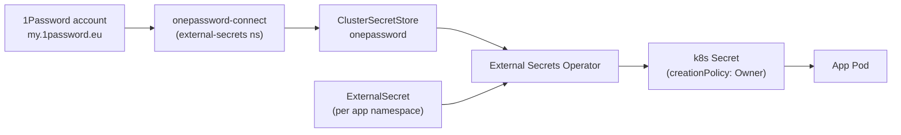

The kuberseni cluster keeps **no application secrets in Git**. Running workloads
receive their credentials from a self-hosted [1Password](https://1password.com/)
vault through the [External Secrets Operator (ESO)](https://external-secrets.io/).
Only the *reference* (which vault item, which field) lives in the repo — never the
value.

For infrastructure secrets at rest (Talos machine secrets, OpenTofu state /
`secrets.tfvars`), see [Secrets at rest](#secrets-at-rest-sops--age) below; those
are encrypted with sops+age before being committed.

## Architecture



- **1Password Connect** runs in-cluster (`onepassword-connect` Service in the
  `external-secrets` namespace, on port `8080`). It fronts the 1Password account so
  the operator never talks to the internet 1Password API directly.
- **ESO** watches `ExternalSecret` objects and materialises a native Kubernetes
  `Secret` for each one, refreshing on a schedule.
- Apps consume the resulting `Secret` normally (env vars, volume mounts,
  `imagePullSecrets`).

## ClusterSecretStore `onepassword`

A single cluster-wide store binds ESO to 1Password Connect. It is bootstrapped
(not GitOps-managed) from `cluster/bootstrap/eso/secretstore.yaml`:

```yaml
apiVersion: external-secrets.io/v1
kind: ClusterSecretStore
metadata:
  name: onepassword
spec:
  provider:
    onepassword:
      connectHost: http://onepassword-connect.external-secrets.svc.cluster.local:8080
      vaults:
        homelab: 1
      auth:
        secretRef:
          connectTokenSecretRef:
            name: onepassword-connect-token
            namespace: external-secrets
            key: token
```

| Field | Value |
| --- | --- |
| Store kind | `ClusterSecretStore` (cluster-wide; usable from any namespace) |
| Name | `onepassword` |
| Provider | `onepassword` |
| Connect host | `http://onepassword-connect.external-secrets.svc.cluster.local:8080` |
| Vault | `homelab` (priority `1`) |
| Auth token | `Secret/onepassword-connect-token` key `token`, namespace `external-secrets` |

The Connect token `Secret` is created once during bootstrap and is itself **not**
in Git:

```bash
kubectl create secret generic onepassword-connect-token \
  -n external-secrets --from-literal=token=<YOUR_CONNECT_TOKEN>
```

## Bootstrap ordering

ESO and 1Password Connect are installed **once** on a fresh cluster by
`infra/scripts/bootstrap-cluster.sh`, before GitOps takes over — the
`ClusterSecretStore` must exist before any `ExternalSecret` can reconcile. Order:

1. Add Helm repos, incl. `external-secrets` and 1Password Connect charts.
2. `helm upgrade --install external-secrets external-secrets/external-secrets`
   into the `external-secrets` namespace, values from
   `cluster/bootstrap/eso/values.yaml` (`installCRDs: true`; pinned to
   control-plane nodes via nodeSelector + tolerations).
3. `helm upgrade --install onepassword-connect 1password/connect` into the same
   namespace (`--set connect.credentials_base64=...`).
4. Create the `onepassword-connect-token` Secret.
5. Wait for the `clustersecretstores.external-secrets.io` CRD to be established,
   then `kubectl apply` the `ClusterSecretStore`.

After this, ArgoCD ([GitOps](/gitops/)) reconciles the per-app `ExternalSecret`
objects from `cluster/apps/`.

## The ExternalSecret pattern

Each app declares an `ExternalSecret` in its own namespace that maps 1Password
item fields to keys of a Kubernetes `Secret`. The canonical example is
cert-manager's Cloudflare token
(`cluster/apps/cert-manager/resources/externalsecrets.yaml`):

```yaml
apiVersion: external-secrets.io/v1
kind: ExternalSecret
metadata:
  name: cloudflare-token-secret
  namespace: cert-manager
spec:
  refreshInterval: 1h
  secretStoreRef:
    kind: ClusterSecretStore
    name: onepassword
  target:
    name: cloudflare-token-secret   # name of the k8s Secret ESO creates
    creationPolicy: Owner
  data:
    - secretKey: cloudflare-token    # key inside the k8s Secret
      remoteRef:
        key: "cert-manager-cloudflare"   # 1Password item name
        property: api_token              # field on that item
```

Conventions used across every `ExternalSecret` in the repo:

| Setting | Convention |
| --- | --- |
| `spec.refreshInterval` | `1h` |
| `spec.secretStoreRef` | `kind: ClusterSecretStore`, `name: onepassword` |
| `spec.target.creationPolicy` | `Owner` (ESO owns the resulting Secret) |
| `remoteRef.key` | the 1Password **item** name (e.g. `captain-core`) |
| `remoteRef.property` | the **field** on that item (e.g. `api_token`) |
| API version | `external-secrets.io/v1` |

A single item can supply many keys — e.g. `captain-core`
(`cluster/apps/captain-core/externalsecret.yaml`) pulls seven fields
(`nuffield_email`, `nuffield_password`, `telegram_bot_token`, `telegram_chat_id`,
`gcal_client_id`, `gcal_client_secret`, `gcal_refresh_token`) from one 1Password
item into one `Secret`. An `ExternalSecret` may also reference **multiple** items:
`renovate` (`cluster/apps/renovate/externalsecret.yaml`) reads its license/App
fields from the `renovate-ce` item and reuses GHCR creds from the `claudtainer`
item in the same store.

### More examples in the repo

| App | File | 1Password item(s) |
| --- | --- | --- |
| cert-manager | `cluster/apps/cert-manager/resources/externalsecrets.yaml` | `cert-manager-cloudflare` |
| captain-core | `cluster/apps/captain-core/externalsecret.yaml` | `captain-core` |
| renovate | `cluster/apps/renovate/externalsecret.yaml` | `renovate-ce`, `claudtainer` |
| qbittorrent (VPN) | `cluster/apps/media/qbittorrent/externalsecrets.yaml` | `qbittorrent-vpn` |
| cast-sponsor-skip | `cluster/apps/media/cast-sponsor-skip/externalsecrets.yaml` | `cast-sponsor-skip` |

## GHCR image-pull secret pattern

Private `ghcr.io` images (e.g. `ghcr.io/arsenikki/captain-core`) need a
`dockerconfigjson` pull secret. Rather than store the encoded config, ESO
**templates** it from two plain fields using
`spec.target.template`. From `cluster/apps/captain-core/externalsecret.yaml`:

```yaml
apiVersion: external-secrets.io/v1
kind: ExternalSecret
metadata:
  name: ghcr-credentials
  namespace: captain-core
spec:
  refreshInterval: 1h
  secretStoreRef:
    kind: ClusterSecretStore
    name: onepassword
  target:
    name: ghcr-credentials
    creationPolicy: Owner
    template:
      type: kubernetes.io/dockerconfigjson
      data:
        .dockerconfigjson: '{"auths":{"ghcr.io":{"username":"{{ .ghcr_username }}","password":"{{ .ghcr_pat }}","auth":"{{ printf `%s:%s` .ghcr_username .ghcr_pat | b64enc }}"}}}'
  data:
    - secretKey: ghcr_username
      remoteRef:
        key: "captain-core"
        property: ghcr_username
    - secretKey: ghcr_pat
      remoteRef:
        key: "captain-core"
        property: ghcr_pat
```

How it works:

- `data` pulls the raw `ghcr_username` and `ghcr_pat` fields from the 1Password
  item into template variables `.ghcr_username` / `.ghcr_pat`.
- `template.type: kubernetes.io/dockerconfigjson` makes ESO emit a Docker-registry
  pull secret; the `.dockerconfigjson` string is rendered with Go templating,
  base64-encoding `username:pat` via `b64enc` for the `auth` field.
- The Deployment references it directly, e.g. captain-core's Pod spec:
  ```yaml
  imagePullSecrets:
    - name: ghcr-credentials
  ```

## Secrets at rest (sops + age)

Not everything can go through ESO — bootstrap-time infrastructure secrets must be
committed. Those are encrypted with [sops](https://github.com/getsops/sops) +
[age](https://github.com/FiloSottile/age) per the rules in `.sops.yaml`, e.g. the
Talos machine secrets and OpenTofu `secrets.tfvars`. Decrypt/inject at use time,
for example:

```bash
sops exec-file secrets.tfvars 'tofu <cmd> -var-file={}'
```

## Rules of the road

- **Never commit a secret value.** Add the value to the 1Password `homelab` vault,
  then reference it from an `ExternalSecret`. Infra-at-rest secrets go through
  sops+age only.
- Reuse the canonical `ExternalSecret` shape above (`refreshInterval: 1h`,
  `ClusterSecretStore/onepassword`, `creationPolicy: Owner`).
- Put the `ExternalSecret` in the **app's own namespace** and name the `target`
  Secret what the workload expects.
- For registry pull secrets use the `dockerconfigjson` template pattern, not a
  hand-encoded string.

See also: [GitOps](/gitops/) · [Cluster](/cluster/) · [Applications](/applications/)

